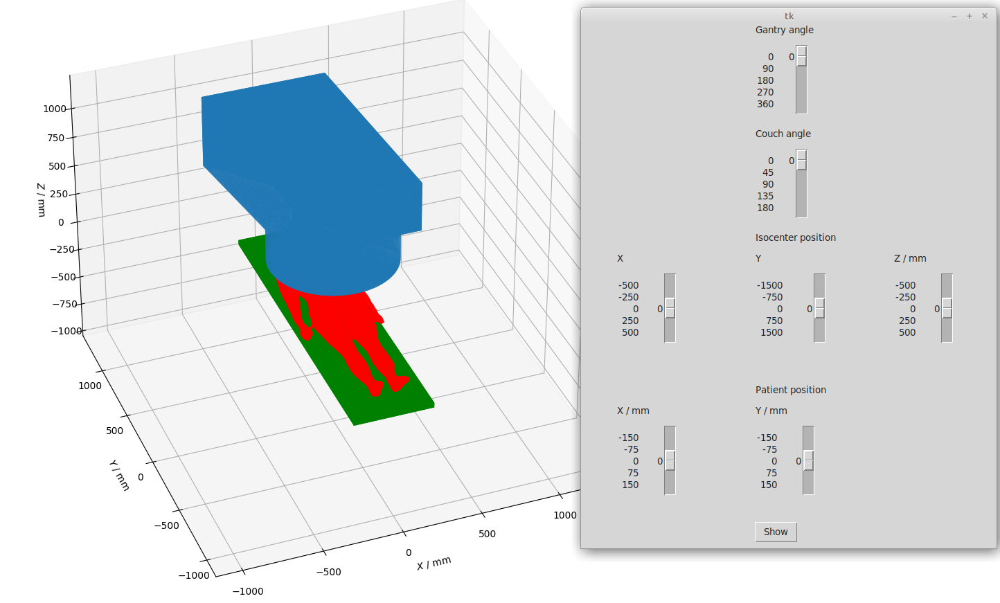

[//]: # (RadCollision-Python)

This folder contains one flavor (or interface layer) of RadCollision. For other languages, consult https://github.com/mghro/rad-collision

Licensing
---------

Please refer to https://github.com/mghro/rad-collision/blob/main/README.md

Requirements
------------

- Python3
- pip3 install numpy math stl matplotlib mpl_toolkits tkinter vtk argparse itertools vedo
- 3D model of your nozzle, couch and patient as STL files

For first attempts, you can use the open-source STL files stored in this [PR](https://github.com/mghro/rad-collision/issues/21#issuecomment-1073840985) or in [https://github.com/SlicerRt/SlicerRT/tree/master/RoomsEyeView/TreatmentMachineModels](SlicerRT).

How to use
----------

Extension scripted in Python language in order to be easily implemented by any TPS. Only gantry and couchs rotations are allowed.

* Collision_detector.py: Script that allows the user to visualize the treatment room and evaluate different configurations to gantry and couch angles and patient and isocenter positions. The program also allows the user the input of his own .stl files  for the patient, the gantry and the couch. Example files are provided in case those are not available.
* AngularConfigurationEvaluator.py: Script that allows the user to quickly analyze all the possible angle configurations in the treatment plan.

Example: `python3 Collision_detector.py --fileGantry RotatingHeads.stl --fileCouch Hexapod.stl --fileBody Standardhumanbody170cm.stl`

Authors
-------

- F. Piqueras Guardiola
- F. Hueso-González
