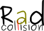

[//]: # (RadCollision)

RadCollision is an open-source platform designed to aid treatment planners in the choice of beam incidence angles that do not collide with the patient or couch.
It loads a 3D model (STL file) of a LINAC and/or couch into a 3D window, that can be rotated interactively to assess collision risk. One can also load a 3D scan of the patient done e.g. with a smartphone, if full patient geometry is needed.

The (currently available) interface layers of the RadCollision platform are:
* <a href="https://github.com/SlicerRt/SlicerRT">SlicerRT</a> (C++) -- full integration into <a href="https://labs.cs.queensu.ca/perklab/wp-content/uploads/sites/3/2024/02/Suriyakumar2017a.pdf">open-source TPS</a>
* <a href="RayStation">RayStation</a> (IronPython2.7/CPython2.7/CPython3.6) -- full integration into proprietary TPS
* <a href="Python3">Python 3</a> -- independent of TPS
* <a href="https://github.com/jlhue/rad-collision-matlab/">MATLAB</a> -- independent of TPS

For RayStation, Here are some screenshots of the capabilities and a news release:
* https://www.youtube.com/watch?v=TlFGaw2NK6Q
* https://www.youtube.com/watch?v=6osJI_xftAE
* https://physicsworld.com/a/open-source-software-detects-potential-collisions-in-radiotherapy-plans/

Alternatives
------------

Alternative solutions are described here:
* References of https://doi.org/10.1088/2057-1976/aba442
* Eclipse: https://doi.org/10.1002/acm2.12673
* Pinnacle: https://doi.org/10.1002/acm2.12915 https://aapm.onlinelibrary.wiley.com/doi/abs/10.1118/1.4924827
* Visual Basic: https://doi.org/10.1016/j.canrad.2020.01.003
* Visual C#.Net: https://doi.org/10.1002/acm2.12963
* MATLAB: https://doi.org/10.1002/acm2.12998
* Unity 3D: https://doi.org/10.3389/fonc.2021.617007
* Varian: https://doi.org/10.1002/acm2.13496

Licensing
---------

This software platform is open-source, and is designed to work / be embedded with commercial TPS through their native scripting interface. You can use, modify and contribute to it. Original attribution/citation shall be granted to:

F Hueso-González et al 2020 - Biomed. Phys. Eng. Express 6 055013, "An open-source platform for interactive collision prevention in photon and particle beam therapy treatment planning". https://doi.org/10.1088/2057-1976/aba442 https://arxiv.org/abs/2007.05248

Please be aware that some submodules used by this software platform contain other licenses specific to these repositories.

Created and documented by
-------------------------

Fernando Hueso-González - fhuesogonzalez@mgh.harvard.edu
Massachusetts General Hospital and Harvard Medical School

Acknowledgment
--------------

Thanks to everyone reporting issues. See also Acknowledgment section on https://doi.org/10.1088/2057-1976/aba442 https://arxiv.org/abs/2007.05248
